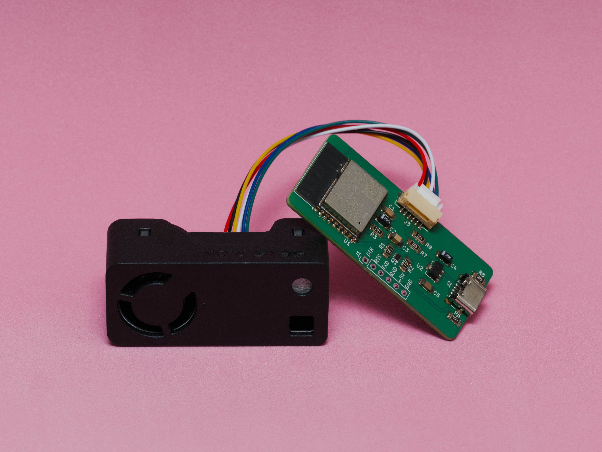

# Tendair

Tendair is a CO2 / Temp / RH / PM2.5 / VOC / NOx sensor hooked up to an ESP32.

It's basically just [this sensor](https://sensirion.com/media/documents/FAFC548D/68C12881/Sensirion_Datasheet_SEN6x.pdf)
with [this micro controller](https://www.digikey.com/en/products/detail/espressif-systems/ESP32-C3-WROOM-02-H4/14553033)

Here is a photo:

This is basically just a new version of my [ESP8266 AQ sensor](https://github.com/tenderlove/esp8266aq).

I haven't made an enclosure yet, I'm working on that now.

## ESPHome

- [esphome#9254](https://github.com/esphome/esphome/pull/9254)
